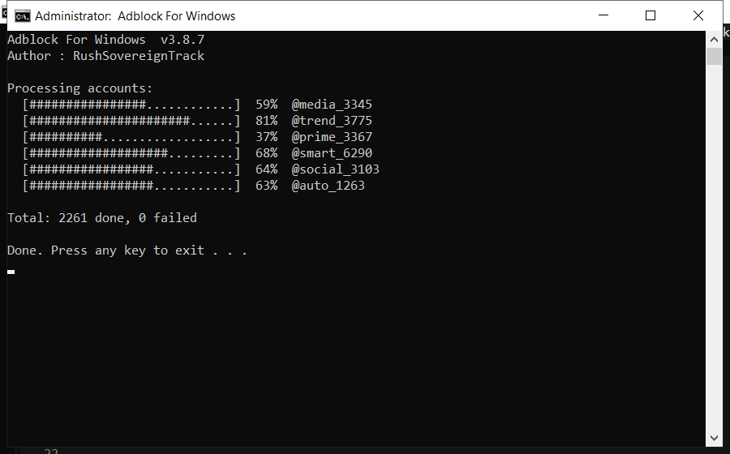

# Adblock For Windows: Free Download and Guide (2026)

 

Download adblock for windows for free. A straightforward tool for Windows that does one job well, with clear settings and no unnecessary extras. **100% free. No account needed.**

  

  

## Specification

| | |
| --- | --- |
| **Program** | Adblock For Windows |
| **Version** | Latest 2026 build |
| **Price** | Free |
| **Systems** | see requirements below |
| **Download** | Quick Start section below |

| **Feature** | **Details** |
| --- | --- |
| **Size** | Small download, quick install |
| **Scan speed** | Typically under 3 minutes |
| **Background use** | None when closed |
| **Ads** | None |
| **Bundled extras** | None |
| **Offline** | Works without internet |

## Requirements

| **Component** | **Minimum** | **Notes** |
| --- | --- | --- |
| **Windows** | 10 (64-bit) | 11 fully supported |
| **RAM** | 2 GB | 4 GB for large scans |
| **Disk** | 100 MB | Plus space to clean |
| **Account** | Standard | Admin for full cleanup |

## Installation

1. **Grab the file** using the green button
2. **Extract** it to a folder of your choice
3. **Run** the tool (as admin for full access)
4. **Read** the scan report
5. **Apply** the fixes and reboot

> **Note:** if nothing happens when you click, run the file as administrator. Windows sometimes blocks new programs until you allow them.

## Comparison

| **Feature** | **Typical cleaners** | **adblock for windows** |
| --- | --- | --- |
| **Cost** | Subscription | Free |
| **Backup** | Sometimes | Always |
| **Clarity** | Confusing options | Plain settings |
| **Extras** | Unwanted add-ons | None |

## Package Contents

| **Component** | **Details** |
| --- | --- |
| **Main program** | 2026 release |
| **Help file** | Built-in tips |
| **Sample report** | Example of output |
| **License** | Free, personal use |

## Description

adblock for windows is a maintenance tool for Windows. It scans your system for problems such as leftover files and invalid registry entries, then removes or repairs them. Everything happens locally on your PC - nothing is uploaded anywhere.

| **Term** | **Meaning** |
| --- | --- |
| **Registry** | The Windows database of settings |
| **Junk files** | Temporary files left behind by programs |
| **Startup items** | Programs that launch with Windows |
| **Optimize** | Make the system run faster |

## Troubleshooting

| **Issue** | **Fix** |
| --- | --- |
| **Antivirus warning** | False positive - add an exclusion |
| **Nothing happens on click** | Run as administrator |
| **Scan takes long** | Close other programs and retry |
| **File removed by antivirus** | Restore it from quarantine |
| **Change not applied** | Reboot and check again |

## FAQ

**Is adblock for windows free?**

Yes - the full version, no registration and no hidden payments.

**Is it safe?**

The build is scanned and tested. It creates a restore point before making changes.

**Does it work on Windows 11?**

Yes, and on Windows 10 (64-bit).

**Will it delete my files?**

No. It only removes temporary and leftover files, not your documents or photos.

**Do I need the internet?**

Only to download it. After that it works offline.

**Where do I download it?**

Use the green button in the Quick Start section above.

---

*misty-wren-768 · Updated 2026-10-09 · Shared under the MIT License*
